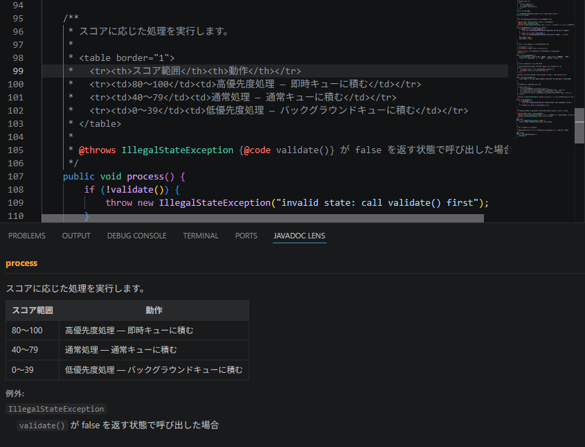

# Javadoc Lens

A VS Code extension that reads Javadoc comments directly from Java source files and renders them as HTML in the bottom panel in real time.

[日本語版 README はこちら](README.ja.md)

## Features

- Automatically displays the Javadoc for the method, class, or field under the cursor
- Renders HTML tags such as `<table>`, `<b>`, and `<pre>` as-is
- Supports inline tags: `{@code}`, `{@link}`, `{@literal}`
- Formats block tags — `@param`, `@return`, `@throws`, `@deprecated` — into readable sections
- Follows definition jumps to show Javadoc for symbols defined in other files

## Usage

1. Open a Java file
2. Select the **JAVADOC LENS** tab in the bottom panel
3. Move the cursor to any method or class with a Javadoc comment — the panel updates automatically

If the panel is not visible, run **Javadoc Lens: Open Settings** from the Command Palette (`Ctrl+Shift+P` / `Cmd+Shift+P`).

## Settings

| Setting | Description | Default |
|---|---|---|
| `javadocLens.debounceMs` | Delay in milliseconds between cursor movement and panel update | `400` |

## Requirements

- VS Code 1.85.0 or later
- Activates automatically when a Java file (`.java`) is opened

## License

MIT
